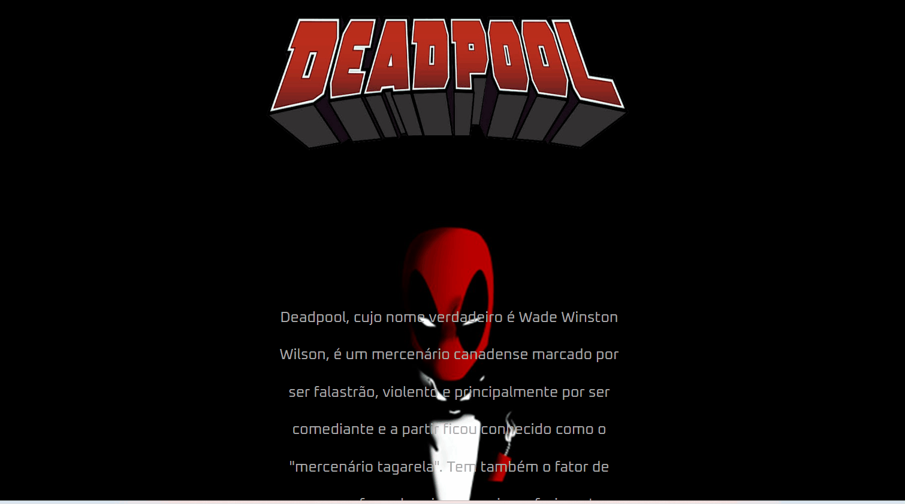
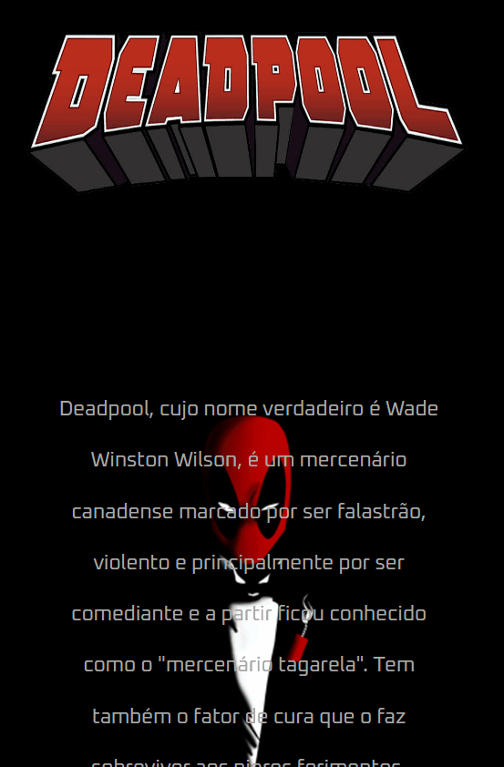

# Projeto deadpool
[]

## Tecnologias utilizadas 
- HTML
- CSS

  
## Como utilizar?
Projeto Deadpool, é um card com descrição do anti heroi da marvel.

 ## O que motivou a fazer esse projeto?
 Esse projeto de card foi inspiração do novo filme do deadpool 3 , é um anti heroi que eu gosto muito e resolvi falar um pouco sobre ele.

 ## Dificuldades encontradas?

  Dificuldades nenhuma, foi um projeto bem fácil de fazer pois ja tinha mais conhecimento quando o fiz , por isso foi bem tranquilo.

 ## Versão mobile
 []

 ## Link
 (https://igorsousasilva.github.io/deadpool/)

 

 
